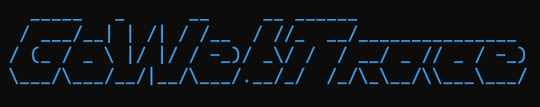
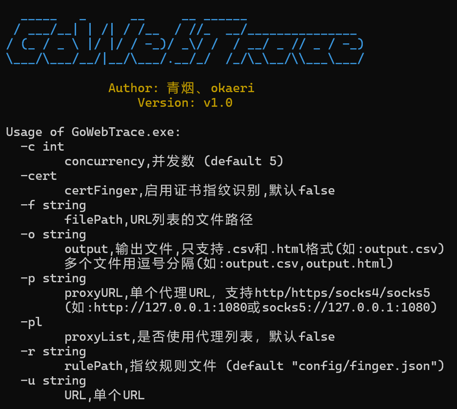
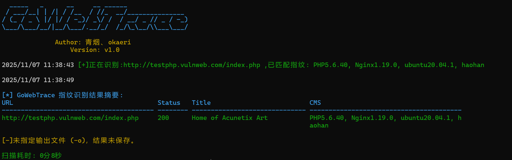
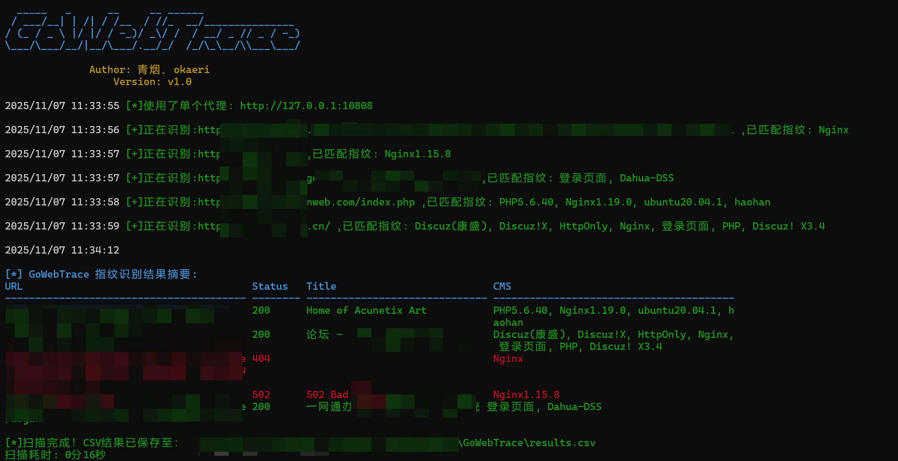

# GoWebTrace


GoWebTrace 是一款基于 Go 语言开发的轻量级、高性能网站指纹识别工具。它旨在精确识别 Web 应用程序的技术栈，包括 CMS、Web 框架和服务器软件。通过利用 Go 的并发特性，它可以高效地扫描多个目标。

## 📖功能特性

- **多维度指纹识别：** 通过分析以下信息来识别技术：
  - **Favicon 哈希：** 匹配 favicon 的 MD5 或 Murmur3 哈希值。
  - **HTTP 响应头：** 匹配响应头中的模式。
  - **HTML 内容：** 匹配响应体和页面标题中的关键字和正则表达式。
  - **TLS 证书：** 提取并显示 TLS 证书信息（可选）。
- **高并发扫描：** 利用 goroutine 并发执行多个扫描任务，显著加快对大量 URL 列表的分析速度。
- **灵活的目标输入：** 支持扫描单个 URL 或包含 URL 列表的文件。
- **代理支持：** 支持通过 HTTP、HTTPS、SOCKS4 或 SOCKS5 代理路由流量。支持单个代理和代理列表。
- **多种输出格式：** 将扫描结果保存为 `.csv` 和 `.html` 格式。
- **跨平台：** 作为 Go 应用程序，它可以编译在 Windows、macOS 和 Linux 上运行。

## 🚍使用方法

### 命令行标志

| 标志  | 描述  | 默认值 | 示例  |
| --- | --- | --- | --- |
| `-u` | 要扫描的单个 URL。 | /   | `-u http://example.com` |
| `-f` | 包含 URL 列表的文件的路径。 | /   | `-f urls.txt` |
| `-c` | 并发扫描线程数。 | `5` | `-c 10` |
| `-r` | 指纹规则文件的路径。 | `config/finger.json` | `-r custom_rules.json` |
| `-o` | 输出文件。支持 `.csv` 和 `.html`。多个文件用逗号分隔。 | /   | `-o results.csv,results.html` |
| `-cert` | 启用 TLS 证书指纹识别。 | `false` | `-cert` |
| `-p` | 单个代理 URL。支持 `http`、`https`、`socks4`、`socks5`。 | /   | `-p http://127.0.0.1:8080` |
| `-pl` | 默认使用 `config/proxyList.txt` 中的代理列表。 | `false` | `-pl` |



### 使用示例

**扫描单个 URL：**

```bash
GoWebTrace -u http://example.com
```



**通过 http 代理扫描 URL文件并将结果保存为 CSV 和 HTML：**

```bash
GoWebTrace -f urls.txt -p http://127.0.0.1:10808 -o results.csv,results.html
```



## 📖源码编译

项目使用Go1.21.0编写

### 1. 编译 Windows 版本

这个命令会生成一个名为 `GoWebTrace.exe` 的文件，可直接在 Windows 系统上运行。

```
go build -o GoWebTrace.exe .
```

### 2. 编译 Linux (64-bit) 版本

为了编译成 Linux 可执行文件，我们需要设置目标操作系统和架构。请在 **Windows 命令提示符 (cmd.exe)** 中执行以下命令：

```
SET GOOS=linux
SET GOARCH=amd64
go build -o GoWebTrace-linux .
```

执行完毕后，您会得到一个名为 `GoWebTrace-linux` 的文件，该文件可以在 64 位的 Linux 系统上运行

## 🚍工作原理

指纹识别过程遵循结构化和优先级的策略，以确保准确性和效率。

### 1. 指纹库规则加载与分类

- 启动时，GoWebTrace 从 `config/finger.json` 加载指纹规则。
- `RuleAnalyzer` 解析这些规则，并根据 `location`（例如 `header`、`body`、`title`）和 `method`（例如 `keyword`、`regex`、`faviconhash`）对它们进行分类。这种预处理使匹配引擎能够快速访问 HTTP 响应的每个部分的相关规则。

### 2. HTTP 请求和响应解析

- 该工具使用可定制的 HTTP 客户端向目标 URL 发送 GET 请求，该客户端可以忽略 TLS 证书错误并通过代理路由流量。
- 它最多会跟踪三次重定向以查找最终目标页面。
- 然后解析 HTML 响应以提取：
  - 页面标题
  - Favicon URL
  - CSS 和 JavaScript 文件链接

### 3. 指纹匹配引擎

匹配引擎按特定顺序处理响应，优先处理置信度更高的方法：

1. **Favicon 哈希匹配：** 下载 favicon，并计算其 MD5 和 Murmur3 哈希值。将这些哈希值与 `faviconhash` 规则进行比较。此处的匹配被认为是高置信度的结果。
2. **标题、响应头和响应体匹配：** 引擎接着将 `keyword` 和 `regex` 规则与页面标题、HTTP 响应头和响应体进行匹配。
3. **版本提取：** 如果规则匹配，`ExtractVersion` 函数会尝试使用正则表达式在响应内容中查找版本号。这使其能够区分例如“Nginx 1.18”和“Nginx”。
4. **冲突解决：** `updateCMS` 函数智能地管理结果。如果找到更具体的指纹（例如，带版本号的指纹），它将替换不太具体的指纹。

### 4. 输出生成

- 扫描完成后，结果将在终端中排序并显示。
- 如果指定了输出文件，结果将以请求的格式（CSV 和/或 HTML）保存，并附带网页截图。

## 📖指纹库编写逻辑

指纹库是识别的核心，理解其结构对于添加新指纹至关重要。每个指纹规则都是一个 JSON 对象，包含四个核心字段：

```json
{
  "cms": "Shiro",
  "method": "keyword",
  "location": "header",
  "keyword": ["rememberMe=deleteMe"]
}
```

- `cms`: 技术或产品的名称（例如 "Nginx", "WordPress"）。
- `method`: 匹配方法，支持关键字、正则和哈希匹配，如 `keyword`（关键字）、`regex`（正则表达式）或 `faviconhash`。
- `location`: 匹配位置，即在 HTTP 响应的哪个部分进行搜索。
- `keyword`: 用于匹配的关键字列表，可匹配响应头、标题、正文内容、路径及 Favicon 哈希。

## 🚍项目结构

├── cmd/ # 命令行界面逻辑
├── config/ # 配置文件目录
├── internal/ # 核心功能目录
├── pkg/ # 通用工具包目录
├── main.go # 主程序入口
├── go.mod # Go 模块文件
├── go.sum # Go 模块依赖文件

## ⚠️ 免责声明

本工具仅用于授权的安全测试和研究目的。使用者应遵守当地法律法规，不得用于非法活动。作者不对使用本工具造成的任何后果承担责任。# GoWebTrace


